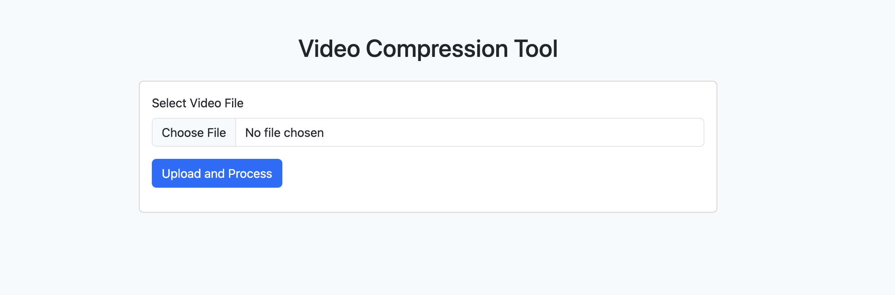
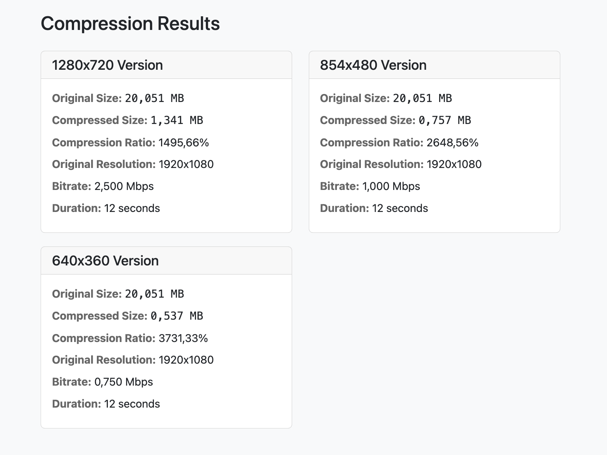

# Video Compression Platform (VCP)

A robust and efficient video compression service built with Spring Boot and FFmpeg, designed to optimize video files while maintaining quality.

## 🚀 Features

- High-performance video compression
- Multiple output format support (MP4, WebM, etc.)
- RESTful API interface
- Docker support
- Configurable compression parameters
- Progress tracking
- Batch processing capability

## 📸 Screenshots




## 🛠️ Prerequisites

- Java 17 or higher
- Maven 3.6+
- FFmpeg
- Docker (optional)

## 📦 Installation

### Local Setup

1. Install FFmpeg:

   ```bash
   # macOS (using Homebrew)
   brew install ffmpeg

   # Ubuntu/Debian
   sudo apt-get update
   sudo apt-get install ffmpeg

   # Windows (using Chocolatey)
   choco install ffmpeg
   ```

2. Clone the repository:

   ```bash
   git clone https://github.com/yourusername/vcp.git
   cd vcp
   ```

3. Build the project:
   ```bash
   ./mvnw clean install
   ```

### Docker Setup

1. Build the Docker image:

   ```bash
   docker build -t vcp .
   ```

2. Run the container:
   ```bash
   docker run -p 8080:8080 vcp
   ```

## 🔧 Configuration

The application can be configured through `application.properties`:

```properties
# Server configuration
server.port=8080

# File upload settings
spring.servlet.multipart.max-file-size=1000MB
spring.servlet.multipart.max-request-size=1000MB

# Compression settings
vcp.output.directory=/tmp/compressed
vcp.processing.threads=2
```

## 🎯 API Usage

### Compress Video

```bash
curl -X POST \
  http://localhost:8080/api/v1/compress \
  -H 'Content-Type: multipart/form-data' \
  -F 'file=@video.mp4' \
  -F 'quality=medium'
```

### Check Compression Status

```bash
curl -X GET \
  http://localhost:8080/api/v1/status/{jobId}
```

## 🔍 Technical Details

### Architecture

- **Spring Boot Backend**: Handles HTTP requests, file management, and job queuing
- **FFmpeg Integration**: Core video processing engine
- **Async Processing**: Non-blocking operation handling
- **Queue Management**: Priority-based job processing

### Compression Profiles

| Profile | Resolution | Bitrate | Use Case         |
| ------- | ---------- | ------- | ---------------- |
| High    | Original   | 2Mbps   | Quality priority |
| Medium  | 720p       | 1Mbps   | Balanced         |
| Low     | 480p       | 500Kbps | Size priority    |

### Performance

- Concurrent processing support
- Adaptive bitrate based on input quality
- Hardware acceleration when available

## 🤝 Contributing

1. Fork the repository
2. Create your feature branch (`git checkout -b feature/amazing-feature`)
3. Commit your changes (`git commit -m 'Add amazing feature'`)
4. Push to the branch (`git push origin feature/amazing-feature`)
5. Open a Pull Request

## 📝 License

This project is licensed under the MIT License - see the [LICENSE](LICENSE) file for details.

## 🔮 Future Improvements

- [ ] GPU acceleration support
- [x] Additional codec support
- [x] Web interface
- [x] Cloud storage integration
- [ ] Advanced queue management
- [ ] Webhook notifications

## 📦 Artifacts

- `video-compression-app-1.0.0.jar`: Executable JAR file
- Source code (zip/tar.gz)
