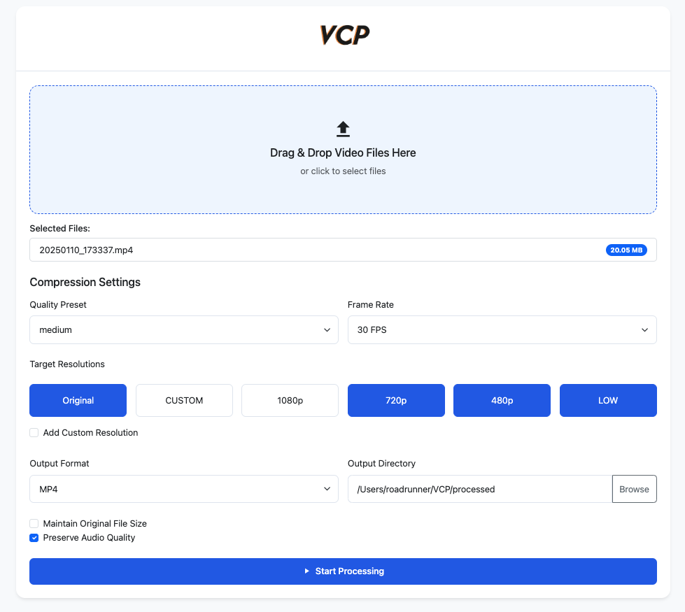

# Video Compression Platform (VCP)


A robust and efficient video compression service built with Spring Boot and FFmpeg, designed to optimize video files while maintaining quality.

## 📸 Screenshot

#### WEB GUI




#### DESKTOP APP Support Added check our [Release Page](https://github.com/syswe/vcp/releases) !

coming soon brew pkg on macOS !

## 🚀 New Features v.1.0.0

- Multiple compression presets (Low, Medium, High)
- Comprehensive resolution management (4K to 360p)
- Flexible frame rate control (24, 30, 60 FPS)
- Multiple output format support (MP4, WebM, MKV)
- Batch processing capability
- Intelligent file naming convention
- Audio quality preservation options
- Original aspect ratio maintenance
- Progress tracking and detailed results
- Modern, responsive web interface
- OpenAPI/Swagger documentation

## 📚 API Documentation

The API documentation is available through Swagger UI at: `http://localhost:8080/swagger-ui.html`

### Available Endpoints

#### 1. Compress Video

```http
POST /api/v1/compress
Content-Type: multipart/form-data
```

**Parameters:**

- `files` (required): Video files to compress (multiple files supported)
- `preset`: Compression quality preset (LOW/MEDIUM/HIGH, default: MEDIUM)
- `resolutions`: Target resolutions (e.g., ORIGINAL, FHD, HD, multiple values supported)
- `frameRate`: Target frame rate in fps (default: 30)
- `maintainOriginalSize`: Whether to maintain original file size (default: false)
- `preserveAudioQuality`: Whether to preserve original audio quality (default: true)
- `outputFormat`: Output video format (mp4/webm/mkv, default: mp4)

**Example:**

```bash
curl -X POST http://localhost:8080/api/v1/compress \
  -F "files=@video1.mp4" \
  -F "files=@video2.mp4" \
  -F "preset=HIGH" \
  -F "resolutions=FHD" \
  -F "resolutions=HD" \
  -F "frameRate=60" \
  -F "outputFormat=mp4"
```

#### 2. Detect Available Resolutions

```http
POST /api/v1/detect-resolutions
Content-Type: multipart/form-data
```

**Parameters:**

- `video` (required): Video file to analyze

**Example:**

```bash
curl -X POST http://localhost:8080/api/v1/detect-resolutions \
  -F "video=@video.mp4"
```

#### 3. Get Output Directory

```http
GET /api/v1/output-directory
```

**Example:**

```bash
curl http://localhost:8080/api/v1/output-directory
```

#### 4. Set Output Directory

```http
POST /api/v1/output-directory
```

**Parameters:**

- `directory` (required): New output directory path

**Example:**

```bash
curl -X POST http://localhost:8080/api/v1/output-directory \
  -d "directory=/path/to/output"
```

### Response Formats

#### CompressionResult

```json
{
  "fileName": "string",
  "resolution": "string",
  "originalSize": 0,
  "compressedSize": 0,
  "compressionRatio": 0,
  "originalResolution": "string",
  "bitrate": 0,
  "duration": 0,
  "outputPath": "string"
}
```

#### Resolution List

```json
["ORIGINAL", "UHD_4K", "QHD", "FHD", "HD", "SD", "LOW"]
```

### Custom Resolution Format

To use custom resolutions, format the resolution parameter as:

- `CUSTOM_WIDTHxHEIGHT`: For exact dimensions (e.g., `CUSTOM_1920x1080`)
- `CUSTOM_WIDTHxHEIGHT_ASPECT`: To maintain aspect ratio (e.g., `CUSTOM_1920x1080_ASPECT`)

## 🎯 Compression Options

### Quality Presets

| Preset | Bitrate  | Speed    | CRF | Use Case         |
| ------ | -------- | -------- | --- | ---------------- |
| Low    | 500 Kbps | slow     | 28  | Size priority    |
| Medium | 2 Mbps   | medium   | 23  | Balanced         |
| High   | 5 Mbps   | veryslow | 18  | Quality priority |

### Supported Resolutions

- Original (maintain source)
- 4K UHD (3840x2160)
- 1440p QHD (2560x1440)
- 1080p FHD (1920x1080)
- 720p HD (1280x720)
- 480p SD (854x480)
- 360p Low (640x360)
- Custom (user-defined)

### Frame Rates

- 24 FPS (Cinematic)
- 30 FPS (Standard)
- 60 FPS (High motion)

### Additional Options

- Maintain original size
- Preserve audio quality
- Multiple output formats (MP4, WebM, MKV)
- Custom output naming

## 📦 Prerequisites

- Java 17 or higher
- Maven 3.6+
- FFmpeg (with ffprobe)
- Docker (optional)

## 🛠️ Installation

### FFmpeg Installation

```bash
# macOS (using Homebrew)
brew install ffmpeg

# Ubuntu/Debian
sudo apt-get update
sudo apt-get install ffmpeg

# Windows (using Chocolatey)
choco install ffmpeg
```

### Local Setup

1. Clone the repository:

   ```bash
   git clone https://github.com/yourusername/vcp.git
   cd vcp
   ```

2. Build the project:

   ```bash
   ./mvnw clean install
   ```

3. Run the application:
   ```bash
   ./mvnw spring-boot:run -Dspring-boot.run.arguments=--server.port=8080
   ```

### Docker Setup

1. Build the Docker image:

   ```bash
   docker build -t vcp-spring .
   ```

2. Run the container:

   ```bash
   # Run with default port 8080
   docker run -p 8080:8080 vcp-spring

   # Run with custom port (e.g., 9090)
   docker run -p 9090:8080 vcp-spring

   # Run with mounted volumes for persistent storage
   docker run -p 8080:8080 \
     -v $(pwd)/processed:/app/processed \
     -v $(pwd)/uploads:/app/uploads \
     vcp-spring
   ```

3. Access the application:
   ```bash
   http://localhost:8080
   ```

Note: The Docker container uses port 8080 internally. You can map it to any external port using the `-p` flag.

## 🔧 Configuration

The application can be configured through `application.properties`:

```properties
# Server configuration
server.port=0 # Let Spring Boot choose a random port servlet

# File upload settings
spring.servlet.multipart.max-file-size=1000MB
spring.servlet.multipart.max-request-size=1000MB

# Compression settings
vcp.output.directory=processed
vcp.upload.directory=uploads
vcp.processing.threads=2
```

## 💻 Usage

### Web Interface

1. Access the web interface at `http://localhost:<port>`
2. Select one or multiple video files
3. Configure compression options:
   - Quality preset (Low/Medium/High)
   - Target resolution
   - Frame rate
   - Output format
   - Additional options
4. Click "Upload and Process"
5. View detailed compression results

### REST API

#### Compress Video

```bash
curl -X POST \
  http://localhost:8080/api/v1/compress \
  -H 'Content-Type: multipart/form-data' \
  -F 'file=@video.mp4' \
  -F 'preset=MEDIUM' \
  -F 'resolution=HD' \
  -F 'frameRate=30' \
  -F 'outputFormat=mp4'
```

## 🔍 Technical Details

### Architecture

- Spring Boot backend with Thymeleaf templates
- FFmpeg integration via Java wrapper
- Asynchronous processing support
- Multi-platform compatibility (Windows, macOS, Linux)

### File Naming Convention

- Single compression: `filename_compressed.format`
- Resolution-specific: `filename_1080p.format`
- Custom naming: `filename_preset_resolution.format`

### Performance Features

- Batch processing support
- Automatic FFmpeg path detection
- Smart error handling
- Progress tracking
- Detailed compression statistics

## 🤝 Contributing

1. Fork the repository
2. Create your feature branch (`git checkout -b feature/amazing-feature`)
3. Commit your changes (`git commit -m 'Add amazing feature'`)
4. Push to the branch (`git push origin feature/amazing-feature`)
5. Open a Pull Request

## 📝 License

This project is licensed under the MIT License - see the [LICENSE](LICENSE) file for details.
